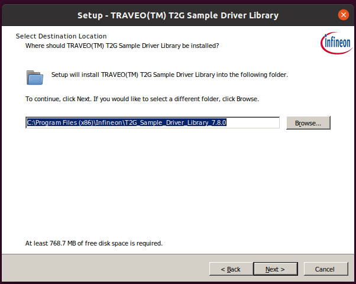
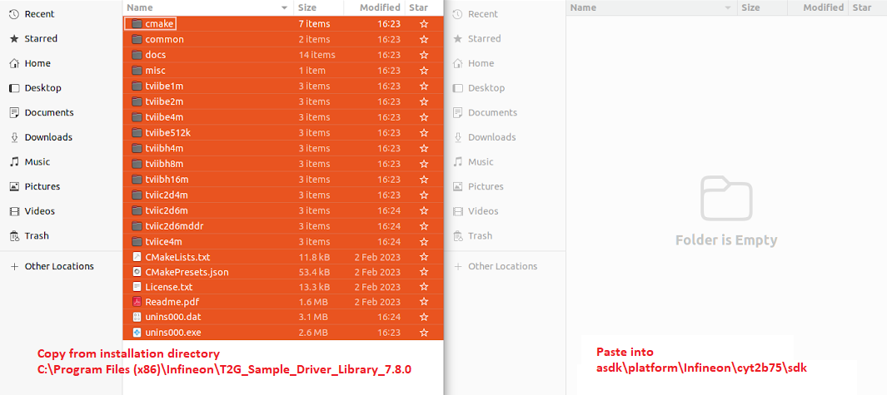

# Setup Infineon CYT2B75 Platform

This guide provides step-by-step instructions to set up the Infineon CYT2B75 platform for development with ASDK. Follow the steps below to install the required SDK, copy the SDK files, and apply the necessary patches.

## 1. Download and Install the SDK

- Download the T2G Sample Driver Library [v7.8.0](https://itoolspriv.infineon.com/itbhs/api/packages/com.ifx.tb.tool.traveoiisampledriverlibrary/Versions/7.8.0/artifacts/sdl_installer_v7.8.0_w_ex_control_txt.zip/download).
- Run the installer and use the default installation options. The default path is `C:\Program Files (x86)\Infineon\T2G_Sample_Driver_Library_7.8.0`
    
    

## 2. Copy SDK Files to ASDK Workspace

- After installation, locate the SDK directory specified during setup.
- Copy the entire contents of `C:\Program Files (x86)\Infineon\T2G_Sample_Driver_Library_7.8.0` and paste it into `asdk/platform/Infineon/cyt2b75/sdk` directory.
    
    

## 3. Apply Platform Patch

- Open a terminal and navigate to the `asdk/platform/cyt2b75/` directory.
    ```cmd
    cd asdk\platform\Infineon\cyt2b75\
    ```

- Run the appropriate patch script for your operating system:
    - **Windows:**
        ```cmd
        app_patch.bat
        ```
    - **Ubuntu/macOS:**
        ```sh
        ./app_patch.sh
        ```

    <details>
    <summary>Click to see patch applied successfully output</summary>

    ```sh
    platform/Infineon/cyt2b75/sdk_patch:10: trailing whitespace.

    platform/Infineon/cyt2b75/sdk_patch:34: trailing whitespace.
        
    platform/Infineon/cyt2b75/sdk_patch:41: trailing whitespace.
        
    platform/Infineon/cyt2b75/sdk_patch:162: trailing whitespace.
        
    platform/Infineon/cyt2b75/sdk_patch:181: trailing whitespace.
        uint32_t irq_error_interrupt_enable_bits = 0x3FF70000;    
    Checking patch platform/Infineon/cyt2b75/sdk/common/src/drivers/canfd/cy_canfd.c...
    Checking patch platform/Infineon/cyt2b75/sdk/common/src/drivers/scb/cy_scb_spi.c...
    Checking patch platform/Infineon/cyt2b75/sdk/common/src/drivers/tcpwm/cy_tcpwm_counter.c...
    Checking patch platform/Infineon/cyt2b75/sdk/tviibe1m/src/interrupts/rev_d/cy_interrupt_map.c...
    Checking patch platform/Infineon/cyt2b75/sdk/tviibe1m/src/system/rev_d/system_tviibe1m_cm0plus.c...
    Checking patch platform/Infineon/cyt2b75/sdk/tviibe1m/src/system/rev_d/system_tviibe1m_cm4.c...
    Applied patch platform/Infineon/cyt2b75/sdk/common/src/drivers/canfd/cy_canfd.c cleanly.
    Applied patch platform/Infineon/cyt2b75/sdk/common/src/drivers/scb/cy_scb_spi.c cleanly.
    Applied patch platform/Infineon/cyt2b75/sdk/common/src/drivers/tcpwm/cy_tcpwm_counter.c cleanly.
    Applied patch platform/Infineon/cyt2b75/sdk/tviibe1m/src/interrupts/rev_d/cy_interrupt_map.c cleanly.
    Applied patch platform/Infineon/cyt2b75/sdk/tviibe1m/src/system/rev_d/system_tviibe1m_cm0plus.c cleanly.
    Applied patch platform/Infineon/cyt2b75/sdk/tviibe1m/src/system/rev_d/system_tviibe1m_cm4.c cleanly.
    warning: squelched 18 whitespace errors
    warning: 6 lines applied after fixing whitespace errors.
    ```
    </details>

---

✅ You have successfully set up the SDK and applied the required patch, you can continue to to build and develop your application using the Infineon CYT2B75 platform by following the link below.

[← Back to Getting Started](../../../README.md/#4-platform-setup)

---

## Frequently Asked Questions

### Q1: Build failures

**Symptom:**
If you see the following error, it means you have not copied the SDK files into the `platform/Infineon/cyt2b75/sdk` directory:
```sh
CMake Error at platform/Infineon/cyt2b75/CMakeLists.txt:121 (ADD_LIBRARY):
  Cannot find source file:
    C:/Users/ajmeri.j/Desktop/work/github/asdk/platform/Infineon/cyt2b75/sdk/common/src/drivers/syslib/gcc/cy_syslib_gcc.S

CMake Error at platform/Infineon/cyt2b75/CMakeLists.txt:121 (ADD_LIBRARY):
  No SOURCES given to target: cyt2b75_sdk

CMake Generate step failed.  Build files cannot be regenerated correctly.
build failed.
```

**Solution:**

Ensure that the `sdk` directory exists at `asdk/platform/Infineon/cyt2b75/sdk` and contains the required files from the T2G Sample Driver Library. If it does not exist, return to [Step 2: Copy SDK Files to ASDK Workspace](#2-copy-sdk-files-to-asdk-workspace) and complete the setup process.

---
